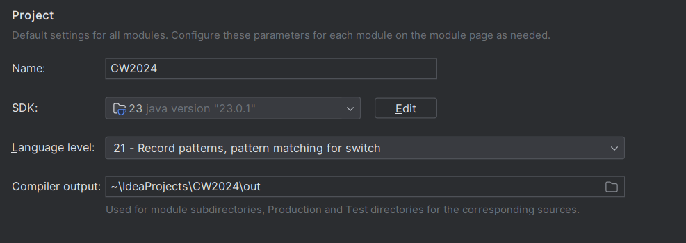
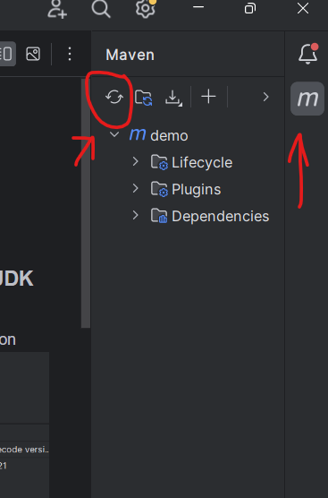
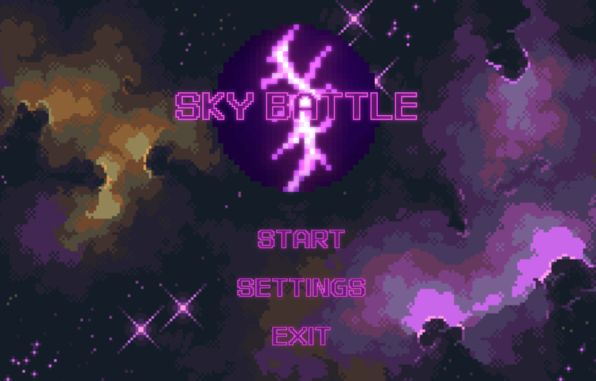

# COMP2042 Developing Maintainable Software
## Table of Contents

---
- [GitHub](#github)
- [Compilation Instructions](#compilation-instructions)
- [Implemented and Working Properly](#implemented-and-working-properly)
- [Implemented but Not Working Properly](#implemented-but-not-working-properly)
- [Features Not Implemented](#features-not-implemented)
- [New Java Classes](#new-java-classes)
- [Modified Java Classes](#modified-java-classes)
- [Unexpected Problems](#unexpected-problems)

## GitHub

---

Name: Sia Ray Young

Student ID: 20495603

https://github.com/Raelyne/CW2024.git

## Compilation Instructions
[Back to Table of Contents](#table-of-contents)

---
### Setup Summary
- Java Development Kit (JDK) 21 and above
- JavaFX 21 and above
- Maven 3.9.5 and above
- IntelliJ Community Edition 2023.3.4 and above
- Git (mandatory to clone the repository)


- Reload Maven to ensure all JavaFX dependencies are up to date

### 1. Ensure you have installed JDK 21 or JDK 23
- Currently, Oracle offers JDK 21 or JDK 23 for installation.
- JDK 23 is preferred
- You can find the download link here:
  https://www.oracle.com/cis/java/technologies/downloads/#jdk23-windows

### 2. Ensure you have installed JavaFX ver 21 and above
- Ensure that you are at least using JDK 17 or above as only those versions can support JavaFX 21++.
- You can find the download link here:
https://gluonhq.com/products/javafx/

### 3. Install IntelliJ IDEA Community Edition 2023.3.4
- IntelliJ IDEA Community Edition was used as the IDE to refactor this project. Install 2023.3.4 or above to avoid any unexpected problems.
- You can download it here (make sure to download the community edition):
  https://www.jetbrains.com/idea/download/?section=windows


### 4a. Clone the repository (preferred method)
- After clicking on the gitHub link above, navigate a green button <> Code
- Copy the GitHub repository URL
- Open your IntelliJ
- Go to File > New > Project from Version Control
- Paste the URL from earlier into the URL field
- Click "Clone", and IntelliJ will clone and open the repository.
   ```bash
   git clone repository-url
   cd your-repo
   ```


### 4b. Extract the .zip folder (alternative)
- If needed extract the zip folder.
- Right-click the .zip folder contained and extract it to a safe location
- Then, load the project through the IntelliJ IDE.
- File > Open > Path to the extracted folder

### 5. Ensure that you have downloaded Maven & loaded it after opening in IDE
- You can download Maven using this link:
  https://maven.apache.org/download.cgi
  
  MAKE SURE to press Load to load all build scripts used.

### 6. Ensure that java is marked as a Source Root (IMPORTANT)
#### /src/main/java
- If java does not appear as a "blue folder", or all the java classes have "coffee icons" then java is not properly marked as a source root.
  - In that case, find the location listed above, then right click on java.
  - Right-click > Mark Directory as > Sources Root
  - Click on Sources Root

  
### 7. Ensure that resources folder is marked as a Resources Root (IMPORTANT)
#### /src/main/resources
- If resources does not appear as a white folder with "yellow coins stacked", then it is not marked as a resources folder
  - Right Click > Mark Directory as > Resources Root
  - Click on Resources Root


### 8. Make sure the Main class is set
#### /src/main/java/com/example/demo/controller/Main.java
- Main class may not be set. In this case, you want to check
- Open Main.java
- Open Run > Edit Configurations
- Add a new application config, set main class to Main.java
- Save and try running the project


### 8. Check for Project Structure
- Check if your project structure matches this.


### 9. Ensure that the compiler is running on JDK 21.0.2
For target bytecode version, you can just put 21 as the option


### 10. Ensure that all dependencies in pom.xml are added and up to 21.0.2
The dependencies may show as not 21 or 21.0.2 . Ensure that:

- Maven compiler source and target are **21.**
- Ensure that javafx-controls, javafx-fxml, javafx-media are **added.**
- Dependencies for javafx-controls,javafx-fxml,javafx-media are **21.0.2**.


### 11. Sync Dependencies: Reload Maven to download all needed dependencies
Since javafx.media is a newly added dependency, Maven might have not been updated. So, we can click on the maven option and reload it in order to update it.


### 12. Make sure that the .fxml files are using JavaFX 21.0.2
- Can be found under resources/fxml/
- This is because the .fxml can automatically update to use the most recent javafx ver (currently 23.0.1)
- Can still be compiled without updating, but may cause unexpected errors, so it is better to check and correct it if needed.
- The line for the javafx version can be found under the AnchorPane section.


### 13. Run the Main.java file to start the game
#### /src/main/java/com/example/demo/controller/Main.java
- You can press on the play button on the top right of the screen to run the app.


## Implemented and Working Properly
[Back to Table of Contents](#table-of-contents)

---

### Main Menu
- Allows the game to start on a main menu, outlining the options to start game, manage settings (volume control, look at controls) and exit game

### Settings
- Allows the player to adjust settings and look at controls for the game.
- Volume slider to adjust volume of the background music
- Back button to go back to main menu


### SFX/Music
- Includes SFX for sound effects and background music unique to each level and main menu
- Helps to create an immersive and eerie atmosphere for the player to enjoy fully

### New Enemy Type
- Added Elite Enemies (which are essentially elite versions/stronger version of the normal enemies)
- Includes higher hitpoints, slower movement speed (like a tank), larger projectile size, faster projectile speed
- Has a lower chance to spawn than the normal enemy type


### Obstacles (Environmental Hazard)
- Environmental hazards which work differently from enemies, they do not shoot projectiles but serve as a barrier for enemies
- When colliding, the player will take damage. They are unable to breach defenses (do not count towards penetrated defenses)
- Prevents player from shooting enemies directly if positioned correctly, adding difficulty
- Asteroids (1HP) , Satellites (10HP)
- Will always spawn regardless of how many enemies on the screen


### Pause Game
- Allows the player to pause the current running game on any level.
- This makes the player able to stop for a bit if things are urgent, and they have to stop the game but do not want to lose progress.

### Return to Main Menu
- If the player wants to go back to main menu to look at settings/adjust them, or start a new game they can return back to main menu by pausing
- When game ends either by losing or winning, the player will also be able to return to start another game


### i-Frames
- Creates a moment of invincibility for the user plane
- Does not show unexpected and instant game overs which irritates players due to instantly dying when colliding with players
- Makes the game less punishing and more enjoyable


### 2 New Levels
- Added LevelThree.java and LevelFour.java
- Actually, LevelFour is just the old Boss.java but now with added obstacles for increased difficulty
- LevelTwo and LevelThree has been polished to slowly include elite enemies and obstacles, to provide the player with a sense of progression


### Adjustable Fire Rate/Projectile Delay
- Added projectile delay in turn creating an adjustable fire rate for the player.
- Allows for game balancing and prevents unfair gameplay as it would be too easy if the player could shoot 100 bullets at once
- Promotes scaling of difficulty


## Implemented but Not Working Properly
[Back to Table of Contents](#table-of-contents)

---

### Volume Slider
- While you can adjust the volume of the background music, the settings do not carry over when starting game
- This was due to the instances being separate. Due to time constraints I was not able to properly fix this feature


## Features Not Implemented
[Back to Table of Contents](#table-of-contents)

---

### Power Ups
- Half-developed but later scrapped, this was due to time constraints and a lot of bugs that popped up for a specialised class.
- Collisions would have to be re-written to handle collisions between player plane and power ups as the base code made both actors take damage.
- Majority of the code was already written however this messed up the other existing code


### New Attack Boss Patterns
- Initially, it was planned for the boss to have a laser pattern attack which would last for around 3 seconds and fired every few seconds
- The classes and methods were initialized, but later on scrapped because they caused multitude of problems as the base code was not equipped to handle Projectiles that would stay on the screen like a laser.
- This would also need a major change in code rather than refactoring which was risky
- There are even unused designed assets in resources folder (com/example/demo/LevelUI/warningsign.png)


### Retry Button
- Was to be made together with the back to main menu, but however due to the main menu taking too much time being fixed the retry button could not be added
- Was a decided-upon design choice as I wanted to stay true to/replicate the retro arcade games that do not let you retry, and you can only start from the beginning

### Score System
- Was not added due to time restraints and impending deadline, the idea was only planned quite late which by then did not have enough time

### Kill Counter
- Initially planned to be added, but the game setting after being polished made it clear enough that you just had to kill all enemies
- Also, due to time restraints that it was not added in the final product since the game already made it visually straightforward

  (Initially a planned asset, but felt that it was quite obvious that you had to kill enemies anyway)

### Keybind Editing
- Scrapped due to time constraints, however had some progress going on

## New Java Classes
[Back to Table of Contents](#table-of-contents)

---

### EliteEnemyPlane.java
#### (com/example/demo/actors/enemies/EliteEnemyPlane.java)
- A variant, stronger version of the normal enemy plane
- Stronger hitboxes, shoots more often, moves slower
- Different model, has a similar behavior to normal enemy

### EliteEnemyProjectile.java
#### (com/example/demo/actors/projectile/EliteEnemyProjectile.java)
- A variant projectile for the elite enemy plane
- Bigger hitboxes, projectile travels much faster
- Has similar logic to EnemyProjectile.java

### Obstacle.java
#### (com/example/demo/actors/obstacles/Obstacle.java)
- Superclass of all obstacle instances, hosts the behavioral patterns of all obstacle classes involved
- Allows the obstacle instances to be properly destroyed and initialised

### Asteroid.java
#### (com/example/demo/actors/obstacles/Asteroid.java)
- An instance of obstacle, and a possible spawn of an obstacle
- First obstacle introduced, a weaker version of satellite.java but moves much faster

### Satellite.java
#### (com/example/demo/actors/obstacles/Satellite.java)
- Subclass of Obstacle.java, a separate instance
- Acts as a variant to asteroid, stronger hitpoints than asteroid but moves slower

### MainMenuController.java
#### (com/example/demo/controller/MainMenuController.java)
- Hosts the Main Menu mainmenu.fxml of the game
- Has an option to launchGame(), go to settings or exit the game/app
- Holds the showMainMenu() function, which allows any class to call the Main Menu where needed (specifically the go back to main menu button in win/lose/pause)

### SettingsController.java
#### (com/example/demo/controller/SettingsController.java)
- In charge of connecting the buttons of settings.fxml file and the scene
- Includes a volume slider, and controls for player to refer to
- Back button to go back to main menu

### SoundManager.java
#### (com/example/demo/controller/SoundManager.java)
- A singleton design patterned superclass to allow all classes to globally access soundManager
- Creates, loads and manages all instances of SFX and Background Music
- Includes functions to play,pause,mute that can be called when needed

- 
### PauseImage.java
#### (com/example/demo/images/PauseImage.java)
- Like the other image classes, it hosts the width/height and image directory.
- Created to easily change the image and size/width whenever needed

### LevelThree.java
#### (com/example/demo/levels/LevelThree.java)
- Introduces obstacles to the level/game
- Higher chances of elite enemies spawning instead of normal enemies
- Creates a sense of difficulty increasing and linear progression experience to the player.

### LevelFour.java
#### (com/example/demo/levels/LevelFour.java)
- Initially LevelTwo.java, was moved to the final level as the boss level
- Added new visuals, adjusted boss movements
- Introduced obstacles to increase difficulty and add a challenge

## Modified Java Classes
[Back to Table of Contents](#table-of-contents)

---
### Boss.java
#### (com/example/demo/actors/enemies/Boss.java)
- Initialised shield under boss
  - This was needed so that the shield would be easily shown and also follows the boss around as it moves
- Changed boss image asset used
  - Followed the logic of "eerie thematic horror" for immersion

### EnemyPlane.java
#### (com/example/demo/actors/enemies/EnemyPlane.java)
- Adjusted fire rate, image & hitpoints
- So that the game does not feel too easy - scaling of difficulty
- Gives the whole game a pixel retro arcade game feeling with new asset

### UserPlane.java
#### (com/example/demo/actors/player/UserPlane.java)
- Increased player speed to allow smoother and more satisfying gameplay
- Allows user to maneuver through a lot of bullets, give opportunity for skillful playing
- Added i-Frames to the player for less punishing gameplay
- Added SFX for shooting and when player gets hit, makes game more immersive and responsive
- Changed asset used into pixel graphic to follow the theme
- Gave the player freedom to move left and right
  - This allows the player to feel more freedom as they are not just limited to moving up and down, and they can maneuver around bullets/obstacles more fluidly
  - Also allowed UserProjectile to accept X coordinates of the player for accurate spawning
  
### EnemyProjectile.java
#### (com/example/demo/actors/projectile/EnemyProjectile.java)
- Adjusted speed & size of projectile + changed asset image
- For purpose of scaling difficulty

### UserProjectile.java
#### (com/example/demo/actors/projectile/UserProjectile.java)
- Adjusted speed of projectile & changed asset image
- For purpose of scaling difficulty


### Controller.java
#### (com/example/demo/controller/Controller.java)
- Added stage parameter to allow MainMenuController to pass stage variable
- Allows the scenes to swap between main menu and other scenes at will, which was needed for return to main menu button

### Main.java
#### (com/example/demo/controller/Main.java)
- start() no longer directly launches game, will run showMainMenu() function first
- This is so that the levels don't immediately play, and the player will see the main menu and have a choice to either manage settings first or play

### GameOverImage.java, HeartDisplay.java, ShieldImage.java, WinImage.java
#### (com/example/demo/images/*)
- Designed new assets and adjusted size
  - This is to contribute to the pixel arcade theme atmosphere
- For ShieldImage.java, moved the show/hide shield logic in LevelViewLevelFour.java to ShieldImage.java


### LevelParent.java
#### (com/example/demo/levelparent/LevelParent.java)
##### Added Hash Set to input keys
  - This allows the user to have a streamlined gameplay as there will be no discrepancies when moving and shooting which would produce a "lagging" visual
  - This was solved by adding hash sets which help keep tracks of which keys are already being pressed
  - Optimises gameplay and makes it smoother

##### Added pauseGame() and conditions to check if the game is active/ended
  - Allows the user to pause the game, which is good if the player needs to suddenly stop playing for a while and can come back to it later

##### Added several collision logic to handle the new obstacle classes
  - UserProjectile & Obstacle
  - UserPlane & Obstacle
  - Obstacle Penetrating Defenses (handleObstaclePenetration())

##### Added cleanAssets() in order to clean any no longer needed assets from the screen before moving to next level

##### Added showMainMenuButton() which shows the return to main menu option whenever the game ends by pausing,losing or winning

##### Refactored entire spawn enemy logic, into a **factory design pattern**
  - This makes it easy to adjust what enemies to spawn, how many to spawn, probability of spawning said enemy and other variables
  - Allows the creation of many levels without needing to add many unnecessary code, as levelParent handles all the enemy spawning logic. This makes it easy to handle enemy spawning logic
  - Lessens code cluster and improves code readability


### LevelOne.java
#### (com/example/demo/levels/LevelOne.java)
- Adjusted kills to advance, added level music, probability rates
- For user immersion, and a sense of difficulty increase with each level

### LevelTwo.java
#### (com/example/demo/levels/LevelTwo.java)
- Initially the boss level, now modified to become one of the "waves" levels
- Introduces elite enemies with stronger hitboxes, attacks, slower movement
- Provides the game a linear sense of progression

### LevelFour.java (was BossLevel)
#### (com/example/demo/levels/LevelFour.java)
- Due to more wave levels being added, was changed into LevelFour as the final boss level
- Boss was buffed along with obstacles to make the game more interesting
- Shield Frames & Chance to be Shielded were severely decreased so that the game would still be beatable
- Not too hard, not too easy


### LevelView.java
#### (com/example/demo/levels/LevelView.java)
- Adjusted the images position to centralise them
  - Technical side fix

### LevelViewLevelFour.java
#### (com/example/demo/levels/LevelViewLevelFour.java)
- Renamed from LevelViewLevelTwo -> LevelViewLevelFour.java
  - Since boss level was moved to level four
- Adjusted shield image created and debug statements to make sure shield initialised to root


## Unexpected Problems
[Back to Table of Contents](#table-of-contents)

---

### Memory Leak
- At the start, gotoNextLevel() did not handle the clearing of assets properly. This made the game crash and cause a great amount of pop-ups, to the point of crashing the PC.
- To address the issue, timeline.stop() was added, as well as a new method which was solely responsible for clearing those assets cleanAssets(), which cleared all remaining assets on screen before moving to the next level.

### Shield not appearing for Boss
- The shield was not visible in the boss stage.
- Later, it was discovered that this was due to the order in creation of JavaFX elements, and the shield was actually layered behind in precedence of the background.
- To fix this, the shield was initialized as a part of Boss. This helped to also track the boss movements and move the shield accordingly to the boss.

### UserProjectiles not following the Player's X Position
- After adding the freedom for the player to move left and right in the game, the projectiles when shooting were found to not follow the player's X coordinates as they moved left and right.
- To counter this, the player's X position was now also taken into aspect when shooting projectiles and returning the position for it to be created

### Unrealistic Hitboxes
- It was found that the hitboxes were not true to the images, with the hitboxes often much bigger than expected and causing the player to get hit
- This made the gameplay frustrating, so to counteract the images were resized one by one after being replaced and sizes adjusted to promote a fun gameplay.

### Dying Instantly when Colliding into Enemies
- As the player did not have any "protection" frames, the player could take damage without a rest unlike in arcade games where there would usually be a rest period in between hits.
- To counter this, i-Frames were added along with a visual and audio indicator to let the player know they got hit, and allow the player to know how long they were still invincible for after getting hit.

### Sounds Overlapping Each Other
- When first attempting to add SFX and Music, it took a lot of writing and unnecessary code to just get one section of the game to have background music.
- Then, I decided to use singleton design pattern and created a new class "SoundManager" which would manage all instances of SoundManager. This saved a lot of unnecessary code from being written and helped to manage all instances of SoundPlayer, making it super easy to access SFX and BGMusic as you only had to load and run it
- SoundManager is in a sense, the superclass for SFX/Music
